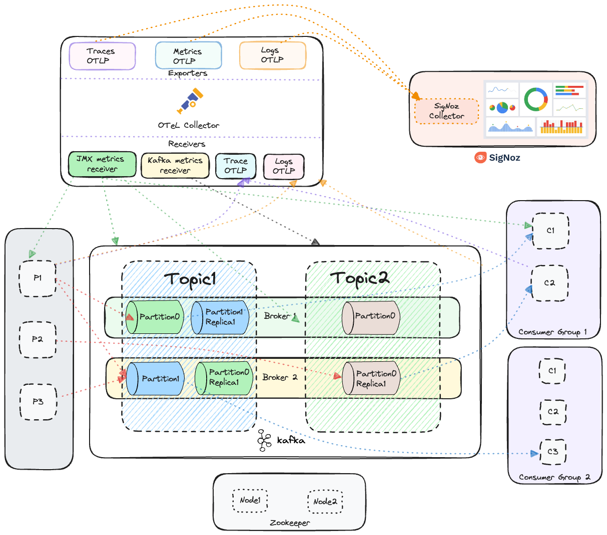

### Introduction
Ready-to-use guide to set up client-side instrumentation and metrics collection (brokers, topics, consumers, producer and consumer clients) in Kafka via opentelemetry and SigNoz.
Soon, we will be introducing deep correlation and insights with producer and consumer spans with minimal configurations so that end users can get deep insights into their Kafka clusters down to every request.



**Note:**
1) This guide is a reference for a production-grade kafka monitoring and instrumentation, this repo is intended to familiarize you with the involved complexities.
2) All the tools used are open source and are licensed under Apache and MIT license.
---
### Steps to follow (ready-to-use guide)
We will follow the following steps:
1) Kafka Setup (VM or container)
2) (optional) Opentelemetry Javaagent installation
2) Java producer-consumer app setup
3) SigNoz setup
4) (optional) Opentelemetry JMX metrics collector agent installation
5) OpenTelmetry collector setup

For the sake of simplicity, (1), (2), and (3) are supposed to be in the same host (VM, laptop, containerised environment).

The last section contains some Troubleshooting tips!!

---
### **Step 1:** Kafka Setup
 - **Kafka installation:** </br>
--> [Download](https://www.apache.org/dyn/closer.cgi?path=/kafka/3.7.0/kafka_2.13-3.7.0.tgz) the latest Kafka release and extract it.
   ```bash
   # unzip the downloaded kafka folder
   tar -xzf kafka_2.13-3.7.0.tgz
   cd kafka_2.13-3.7.0
   ```

- **Start Kafka** (with ZooKeeper, can be done with KRaft as well), create **two brokers** and **two topics:** </br>
--> Start the ZooKeeper service
  ```bash
  bin/zookeeper-server-start.sh config/zookeeper.properties
  ```
  --> Create two server properties files s1 and s2 to start two brokers
  ```bash
  cp config/server.properties config/s1.properties
  ```
  --> Open s1.properties and configure broker.id, listeners, and log directory
  ```bash
  vi config/s1.properties
  ```
  ```bash
  # add the below in s1.properties
  broker.id=0
  listeners=PLAINTEXT://localhost:9092
  logs.dirs=/tmp/kafka_logs-1
  ```
  --> Similarly create s2.properties
  ```bash
  cp config/server.properties config/s2.properties
  ```
  ```bash
  vi config/s2.properties
  ```
  ```bash
  # add the below in s2.properties
  broker.id=1
  listeners=PLAINTEXT://localhost:9093
  logs.dirs=/tmp/kafka-logs-2
  ```
  --> Start Broker 1 and Broker 2 with JMX port enabled to emit Kafka Metrics
  ```bash
  JMX_PORT=2020 bin/kafka-server-start.sh config/s1.properties
  ```
  ```bash
  # in another terminal, start another broker
  JMX_PORT=2021 bin/kafka-server-start.sh config/s2.properties
  ```
  -> Create two Kafka Topics
  ```bash
  bin/kafka-topics.sh --create --topic topic1 --bootstrap-server localhost:9092 --replication-factor 2 --partitions 2
  bin/kafka-topics.sh --create --topic topic2 --bootstrap-server localhost:9092 --replication-factor 2 --partitions 1
  ```
  -> List the kafka topics and partition (to check setup)
  ```bash
  /bin/kafka-topics.sh --describe --topic topic1 --bootstrap-server localhost:9092
  /bin/kafka-topics.sh --describe --topic topic2 --bootstrap-server localhost:9092
  ```
  -> Test kafka setup
  ```bash
  # Write some events into the kafka topic
  bin/kafka-console-producer.sh --topic topic1 --bootstrap-server localhost:9092
  > (type some messages)
  ```
  ```bash
  # open second terminal and consume the messages
  bin/kafka-console-consumer.sh --topic topic1 --from-beginning --bootstrap-server localhost:9092
  > (receive the messages)
  ```
---
### Step 2: Opentelemetry Javaagent installation
- Javaagent setup</br>
  --> Make sure the Java agent is present in the `kafka-opentelemetry-instrumentation/opentelemetry-javagent` directory
  ```bash
  cd kafka-opentelemetry-instrumentation/opentelemetry-javagent
  ls | grep opentelemetry-javaagent.jar
  # should print `opentelemetry-javaagent.jar`
  ```
  --> (_Optional:_) If you wish to install latest version of Java agent
  ```bash
  # !Optional step, if you don't want to use opentelemetry-javaagent.jar present at kafka-opentelemetry-instrumentation/opentelemetry-javagent
  cd kafka-opentelemetry-instrumentation/opentelemetry-javagent
  rm -rf opentelemetry-javaagent.jar
  curl -L -o opentelemetry-javaagent.jar https://github.com/open-telemetry/opentelemetry-java-instrumentation/releases/latest/download/opentelemetry-javaagent.jar
  ```
  --> (_Optional:_) Read OpenTelemetry Java Agent configurations ([reference](https://opentelemetry.io/docs/languages/java/automatic/))</br>

---
### Step 3: Java producer-consumer app setup
   ### Running the Producer and Consumer app with _Opentelemetry Javaagent_
 - Either use jar present in target folders of `kafka-app-otel` or build one, make sure you've Java and mvn installed to build
 --> Go to project root
   ```bash
   cd kafka-opentelemetry-instrumentation
   ```
   --> Run Producer app with Javaagent
    ```bash
   # start a producer
   java -javaagent:${PWD}/opentelemetry-javagent/opentelemetry-javaagent.jar \
           -Dotel.service.name=producer-svc \
           -Dotel.traces.exporter=otlp \
           -Dotel.metrics.exporter=otlp \
           -Dotel.logs.exporter=otlp \
           -jar ${PWD}/kafka-app-otel/kafka-producer/target/kafka-producer-1.0-SNAPSHOT-jar-with-dependencies.jar
   ```
   --> Run Consumer app with Javaagent
   ```bash
   # start consumer
   java -javaagent:${PWD}/opentelemetry-javagent/opentelemetry-javaagent.jar \
           -Dotel.service.name=consumer-svc \
           -Dotel.traces.exporter=otlp \
           -Dotel.metrics.exporter=otlp \
           -Dotel.logs.exporter=otlp \
           -Dotel.instrumentation.kafka.producer-propagation.enabled=true \
           -Dotel.instrumentation.kafka.experimental-span-attributes=true \
           -Dotel.instrumentation.kafka.metric-reporter.enabled=true \
           -jar ${PWD}/kafka-app-otel/kafka-consumer/target/kafka-consumer-1.0-SNAPSHOT-jar-with-dependencies.jar
   ```
---
### Step 4: SigNoz setup
The Metrics and Spans collected from Kafka would be forwarded to SigNoz via intermediary opentelemetry collector to visualise and see how Kafka components behaves as we increase load on it.
- For ease of configuration try [Setup SigNoz Cloud](https://signoz.io/docs/cloud/) 
- (alternatively) Setup SigNoz locally by following [local setup guide](https://signoz.io/docs/install/)

**Note:** If you self host SigNoz in kubernetes, make sure the signoz-collector endpoint is reachable from your host machine where Kafka is installed.
e.g. if you use minikube to setup SigNoz, you would need to use `minikube service <signoz-collector> -n <namespace> --url` to access the service outside minikube, read more [here](https://minikube.sigs.k8s.io/docs/handbook/accessing/) for minikube.

---
### Step 5: OpenTelmetry collector setup
Download the JMX metrics collector to collect Kafka metrics (used in collector config)

---
### Step 6: OpenTelmetry collector setup
Setup a local [opentelemetry-collector-contrib](https://github.com/open-telemetry/opentelemetry-collector-contrib) to collect JMX metrics from Kafka and collect spans generated from Kafka producer and Consumer clients. </br>
The Metrics and Spans collected from Kafka would be forwarded to SigNoz to visualise and see how Kafka behaves as we increase load on it.

Install the local Opentelemetry-contib-collector using the config defined in `collector/collector-contrib-config.yaml`

-> [Install the **opentelemetry-contrib** collector](https://opentelemetry.io/docs/collector/installation/) from your preferred method and use the provided config to send data to SigNoz
e.g. if you're running the binary on your host machine, place it the root of the directory and run
```bash
./otelcol-contrib --config ${PWD}/collector/collector-contrib-config.yaml
```
---
### Troubleshooting

---
### Contributing

If you have some suggestions or want to improve the experience of the repo feel free to create an issue or open a pull request.
